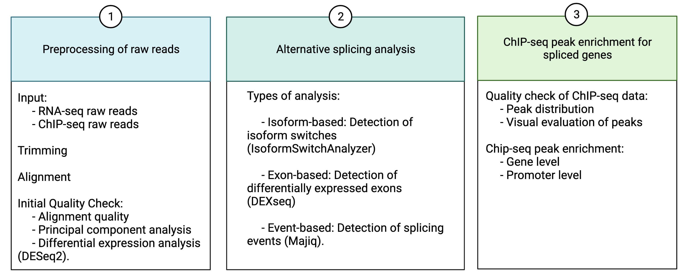
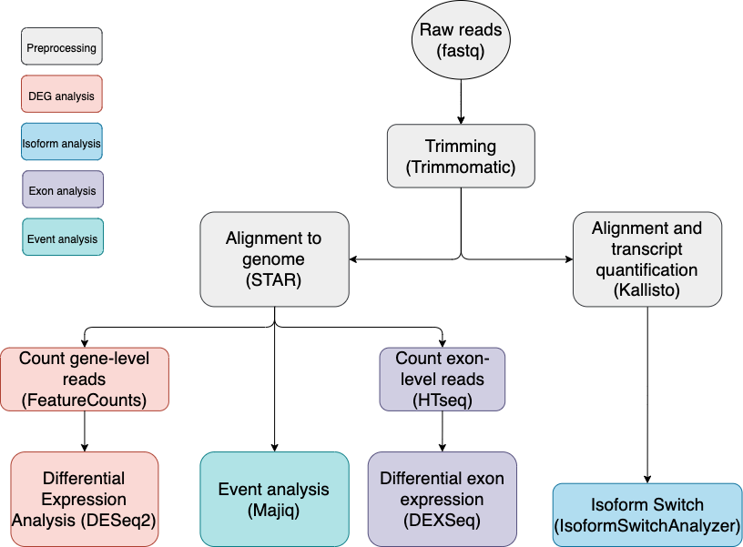
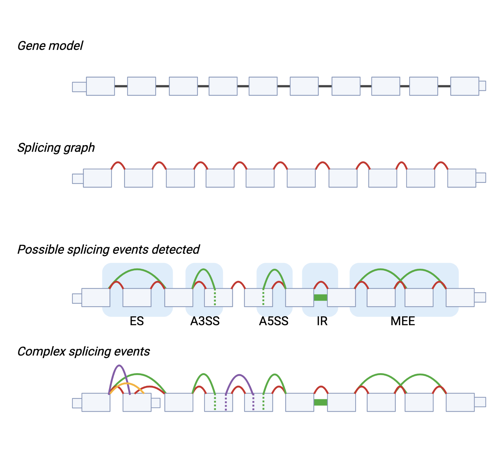

# What is DASiRe?

**Direct Alternative Splicing Regulator predictor (DASiRe)** is a web application that allows non-expert users to perform different types of splicing analysis from RNA-seq experiments and also incorporates ChIP-seq data of a DNA-binding protein of interest to evaluate whether its presence is associated with the splicing changes detected in the RNA-seq dataset. 

DASiRe is an accessible web-based platform that performs the analysis of raw RNA-seq and ChIP-seq data to study the relationship between DNA-binding proteins and alternative splicing regulation. It provides a fully integrated pipeline that takes raw reads from RNA-seq and performs extensive splicing analysis by incorporating the three current methodological approaches to study alternative splicing: isoform switching, exon and event-level. Once the initial splicing analysis is finished, DASiRe performs ChIP-seq peak enrichment in the spliced genes detected by each one of the three approaches. 

# Workflow overview

The main workflow consists of three main steps: 

#### Preprocessing of raw RNA-seq and ChIP-seq reads

Involves trimming of reads with [Trimmomatic](http://www.usadellab.org/cms/?page=trimmomatic), alignment to genome using [STAR](https://github.com/alexdobin/STAR), pseudoalignment to transcriptome with [Kallisto](https://pachterlab.github.io/kallisto/). 

#### Analysis and visualization of alternative splicing results from RNA-seq

The analysis involves the quantification of reads at the gene-level, exon level and isoform to perform the different splicing analysis:

1. Differential expression analysis with [DESeq2](https://bioconductor.org/packages/release/bioc/html/DESeq2.html)
2. Differential exon analysis with [DEXSeq](https://bioconductor.org/packages/release/bioc/html/DEXSeq.html)
3. Isoform swith analysis with [IsoformSwitchAnalyzer](https://bioconductor.org/packages/release/bioc/html/IsoformSwitchAnalyzeR.html)
4. Detection of splicing events with [Majiq](https://majiq.biociphers.org/)

{width=70%}

#### ChIP-seq peak enrichment on spliced genes

Consist on two steps:

1. Quality check of ChIP-seq data: Input ChIP-seq bed files are used to evaluate the peak distribution in the genome visualize the presence or absence of the ChIP-seq protein in specific genomic regions. 
2. Peak enrichment for spliced genes: Evaluate whether the presence of the protein of interest is associted with a specifc splicing outcome detected on RNA-seq data.

# Web interface

{width=90%}

1. Left menu: Switch between the left menu options to import data, visualize the RNA-seq derived data (Quality Check and Splicing Analysis) and the ChIP-seq data (Quality Check and Peak enrichment).
2. Results panel: Allows the visualization of the results from each analysis step.

# Step by step guide

## Installation

The preprocessing step requires the installation of [Docker](https://www.docker.com/).

The analysis steps performed in the web application do not require any additional software.

## Preprocessing of RNA-seq reads

1. Once docker is installed and running, open a terminal and run the command `git clone https://gitlab.lrz.de/ge39jap/DASiRe.git`. Provide user name and password if required. Wait for the repository to download.
2. Go to the input directory with the command `cd DASiRe`.
3. Prepare the input directory with the following files:
  - Fastq files of every sample. DASiRe works with paired-end data, provided they are named in the following format `samplename_1.fastq` and `samplename_2.fastq` for forward and reverse reads. 
  - Metadata file, which is a tab-separated text file containing at least two columns named: sample_id and condition. each row corresponds to a sample, where sample_id column must correspond to the name of the fastq files; i.e. for fastq file named `samplename_1.fastq`the metadata should contain a row with `samplename`. The condition column should indicate `control` or `treated`.
4. Modify `config.sh` file. You can use a text editor, vi or vim.
5. Run the analysis with the command `docker run -v $(pwd)/MOUNT:/MOUNT dasire-clientside:1`. Wait for the analysis to finish, this will take some time. 
6. Once the analysis is finished, the output directory will contain a set of files which are required for the webb application.

## Web-application analysis

1. Go to [exbio.wzw.tum.de/dasire/](exbio.wzw.tum.de/dasire/) on a web browser.
2. In the import option, upload the output of the docker preprocessing step by indicating the path to the output directory created by the preprocessing docker. Alternatively, you can select the `Use example data` to explore the results. Click en `upload`.
3. To upload ChIP-seq data, bed files are required. Note that the chromosome annotation must follow this format: `chr1`, `chr2`, etc, and must have been obtained using the [GRCh38 Gencode](https://www.gencodegenes.org/human/) human annotation. Click en `upload`.

#### RNA-seq analysis

The analysis is divided into several sections. quality control, differential expression, differential exon, isoform switch and splicing events.

{width=30%} 

##### Quality Control: Shows the alignment statistics of STAR and Kallisto.

{width=70%} 

{width=30%} 

##### Differential expression

 - `PCA` tab: Shows the results of DESeq2, including the PCA plot and the heatmap of between sample distance to verify that the samples are grouped according to the biological conditions tested.

\n

 {width=70%}

\n

 - `Gene Normalized Counts` tab: visualization of the normalized counts in each condition for any gene of interest

\n

{width=30%}
 
\n
 
 - `DESeq2 results` tab: visualization of the volcano plot and download the full results
 
\n
 
 {width=50%}
 
\n
 
 - `Splicing factors differential expression`tab: evaluate whether known splicing factors are differentially expressed in the RNA-seq dataset. The list of known splicing factors was taken from the [SpliceAid-F](http://srv00.recas.ba.infn.it/SpliceAidF/) database.

\n

{width=50%}

##### Differential exon

This section shows the results of exon analysis with DEXseq. FOr more information on how DEXseq works and a mora detailed explanation of the output results see [DEXseq documentation](https://bioconductor.org/packages/release/bioc/vignettes/DEXSeq/inst/doc/DEXSeq.html). DEXSeq tests whether an exon is differentially expressed between two or more biological conditions, to retrieve the significant results the user must select the p-value threshold and the fold change. Then click on `Load Analysis`.

- `Summary of DEXseq` tab: Shows the total number of exons tested and the number of exons considered as significantly changed between the conditions. Also, the total number of genes tested is shown, as well as the number of genes containing at least one exon differentially expressed. The user can also visualize any specific gene and the significant exons. 

![Summary of DEXseq results tab. Upper panel described the number of exons evaluated, number of significantly changed exons, and the number of genes with at least one differentially expressed exon. Lower panel shows the visualization of specific genes: y-axis indicates the levels of expression of each exon, x-axis depresents the exons, line colors distinguish between biological conditions tested; the gene model is depicted under the graph, boxes indicate exons and lines introns, pink exons are diffrentially expressed.](Screenshot 2021-12-17 at 3.54.34 p.m..png){width=70%}

- `DEXseq table` tab: Show the full results table from DEXseq.

{width=70%}

##### Isoform switch

This section shows the results of isoform switch analysis with IsoformSwitchAnalyzer For more information on how IsoformSwitchAnalyzer works and a more detailed explanation of the output results see [IsoformSwitchAnalyzer documentation](https://bioconductor.org/packages/release/bioc/vignettes/IsoformSwitchAnalyzeR/inst/doc/IsoformSwitchAnalyzeR.html). IsoformSwitchAnalyzer detects isoform switches between two biological conditions. Significant results are obtained according to default parameters of IsoformSwitchAnalyzer (alpha = 0.05 and dIFcutoff = 0.1).

- `Genome-wide splicing analysis` tab: Describes and compares the splicing changes detected in the isoform switches.

![Genome-wide splicing analysis. Upper plot depicts the number of significant isoforms that involve the splicing event (A3, A5, ATSS, ATTS, ES, IR, MEE, MES), the comparison is made between the isoforms involved in a switch (the one with the most and least usage). Lower plot depicts the usage fraction (y-axis) between the isoforms involved in a switch (IF1 and IF2) with and without an specific splicing event. ATSS, alternative transcription start site;ATTS, alternative transcription termination site; ES, exon skipping; IR, intron retention; MES, multiple exon skipping; MEE, mutually exclusive exons](Screenshot 2021-12-17 at 4.49.25 p.m..png){width=70%}

- `Gene switch plot` tab: Illustrates the annotated isoforms for a specific gene, and highlights the isoforms involved in a switch. The user can select a gene of interest.

{width=70%}

- `Gene switch plot` tab: shows the full results of IsoformSwitchAnalyzer.

{width=70%}

##### Splicing event

This section shows the results of splicing event analysis with Majiq. For more information on how Majiq works and a more detailed explanation of the output results see [Majiq documentation](https://biociphers.bitbucket.io/majiq/). Majiq detects splicing events between two biological conditions. The possible events detected are: exon skipping (ES), alternative 3' splice site (A3SS), , alternative 5' splice site (A5SS), intron retention (IR) and mutually exclusive exons (MEE). Complex events refer to more than one splicing type occurring in the same gene location. 

{width=70%}

- `Number of events` tab: Shows a summary of all the splicing events detected. 

{width=70%}

- `Event table` tab: Full results of Majiq.

#### ChIp-seq analysis

The analysis is divided into two parts: quality check and peak enrichment. 

##### Quality check

This section allows the user to explore the ChIP-seq data. DASiRe incorporates ENCODE ChIP-seq datasets of known splicing factors, such that the user can use them as reference to interpret their own ChIP-seq data. 

- `ENCODE table`: Allows the selection of the ENCODE datasets that will be used as reference. The example data used in this tutorial is performed in K562 cell line and analyzed with the human annotation GRCh38. The table lists the proteins available for comparison.

{width=70%}

- `Peaks visualization`tab: Shows the peak distribution in the genome for each reference ChIP-seq dataset and also the user data. In this example, the user ChIP-seq protein is YBX1.

{width=70%}

- `Gene track`tab: Allows the user to visualize any gene of interest and whether the protein of interest shows occupancy. This is useful to corroborate the presence of the protein in previously validated regions.

{width=70%}

##### Peak enrichment

The main purpose of this section is to evaluate the association between the spliced genes and the presence of a protein 
in a specific RNA-seq dataset. The presence of a protein is taken from the ChiP-seq data that the user gives as input. 

For every splicing type detected in the RNA-seq and the peaks of every ChIP-seq dataset available,the enrichment is performed with Fisher's Exact Test using a contingency as the following example.

|   | Spliced | Non-spliced |
|:---|:-------|:------------|
|With ChIP-seq peak | 10 | 50 |
|Without ChIP-seq peak | 2 | 70 | 

The enrichment is performed at gene or promoter level. The gene analysis uses the number of genes with at least one ChIP-seq peak overlapping any region of the gene (introns and exons); while the promoter analysis calculates the frequencies of genes with at least one ChIP-seq peak overlapping the promoter region of the gene (+-200 bp from the TSS).

- `Gene level peak enrichment`tab: Shows a summary of the enrichment results performed at the gene level. Significant enrichment is considered when pvalue < 0.05. 

{width=70%}

- `Promoter level peak enrichment`tab: Shows a summary of the enrichment results performed at the promoter level. Significant enrichment is considered when pvalue < 0.05. 

{width=70%}

# References

If you use DASiRe, please also cite the following software, which is integrated in our pipeline:

- [Trimmomatic](http://www.usadellab.org/cms/?page=trimmomatic): Bolger, A. M., Lohse, M., & Usadel, B. (2014). Trimmomatic: A flexible trimmer for Illumina Sequence Data. Bioinformatics, btu170.

- [STAR](https://github.com/alexdobin/STAR): Dobin A, Davis CA, Schlesinger F, Drenkow J, Zaleski C, Jha S, Batut P, Chaisson M, Gingeras TR. STAR: ultrafast universal RNA-seq aligner. Bioinformatics. 2013 Jan 1;29(1):15-21.

- [Kallisto](https://pachterlab.github.io/kallisto/): Nicolas L Bray, Harold Pimentel, Páll Melsted and Lior Pachter, Near-optimal probabilistic RNA-seq quantification, Nature Biotechnology 34, 525–527 (2016).

- [DESeq2](https://bioconductor.org/packages/release/bioc/html/DESeq2.html): Love MI, Huber W, Anders S (2014). “Moderated estimation of fold change and dispersion for RNA-seq data with DESeq2.” Genome Biology, 15, 550.

- [DEXSeq](https://bioconductor.org/packages/release/bioc/html/DEXSeq.html): Anders S, Reyes A, Huber W (2012). “Detecting differential usage of exons from RNA-seq data.” Genome Research, 22, 4025.

- [IsoformSwitchAnalyzer](https://bioconductor.org/packages/release/bioc/html/IsoformSwitchAnalyzeR.html): Vitting-Seerup K, Sandelin A (2019). “IsoformSwitchAnalyzeR: Analysis of changes in genome-wide patterns of alternative splicing and its functional consequences.” Bioinformatics. 

- [Majiq](https://majiq.biociphers.org/): Vaquero-Garcia J, Barrera A, Gazzara MR, González-Vallinas J, Lahens NF, Hogenesch JB, Lynch KW, Barash Y. A new view of transcriptome complexity and regulation through the lens of local splicing variations. Elife. 2016 Feb 1;5:e11752.

# Contact

- Marisol Salgado Albarrán (marisol.salgado@tum.de)
- Amit Fenn (amit.fenn@tum.de)
- Chit Tong Lio (chit-tong.lio@wzw.tum.de)

**DASiRe was developed by the [Computational Systems Biology Group](https://www.cosy.bio/) headed by Prof. Dr. Jan Baumbach in Hamburg University.**

